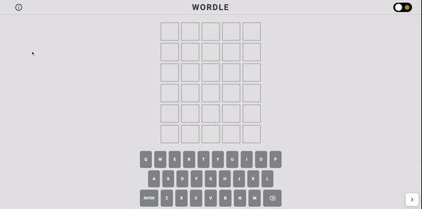

# Wordle

As I am a big fan of puzzle games, I've recently been enjoying playing [Wordle](https://www.nytimes.com/games/wordle/index.html) game. After couple of tries on this game, I figured its mechanisms for state management and animation implementation seem to be simple but not quite as easy to handle as it looks. I thought it would be fun challenging to build this game with my own stacks and logics. 

## Demo

## Stacks
- Next JS
- Typescript 
- Framer-motion 
- Tailwind CSS + SCSS
- Redux 

## What I learned from this project

- How to generate [five letter words data](https://github.com/taesookang/get_five_letter_words).
- How to use retrieve data from **cookie** in SSR(Server Side Rendering) and fetch them into Redux store.
- Latest **Redux**(2022) pratice with Redux toolkit.
- Why most websites minimize use of 3D animation for mobile view. (laggy animation in most mobile web browsers)
- How to implement **dark mode** using tailwind CSS and [next-themes](https://github.com/pacocoursey/next-themes)